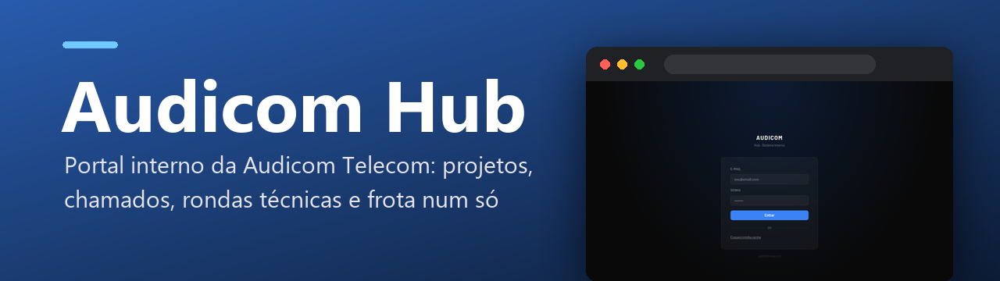
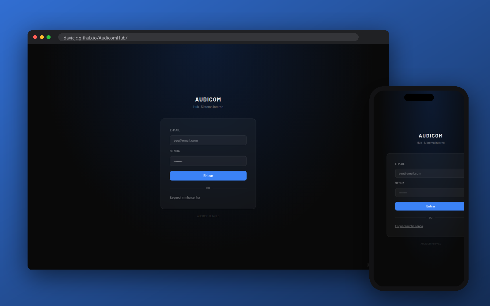

<p align="center">
  
</p>

<p align="center">
  
  <a href="https://davicjc.github.io/AudicomHub/"></a>
  
  
  
  
</p>

<p align="center">Portal interno da Audicom Telecom: projetos, chamados, rondas técnicas, frota e base de conhecimento, com Firebase.</p>


<p align="center">
  
</p>

---

Portal interno da Audicom Telecom para gerenciamento de projetos e suporte técnico.

## Stack

- **Frontend:** Vanilla JS + HTML/CSS
- **Backend:** Firebase Auth + Firestore
- **Ícones:** FontAwesome 6

## Projetos

| Projeto | Descrição |
|---|---|
| `suporte-roteadores` | Base de conhecimento para suporte de roteadores |
| `suporte-operacoes` | Documentação de operações internas |
| `sistema-chamados` | Gerenciamento de chamados |
| `solicitação-manuntenções` | Solicitações de manutenção |
| `ronda-callink` | Registro de rondas técnicas da operação Callink |
| `ronda-barueri` | Registro de rondas técnicas — Callink Barueri |
| `ronda-jundiai` | Registro de rondas técnicas — Callink Jundiaí |

## Estrutura de arquivos

```
index.html              → Login
hub.html                → Hub principal (lista de projetos)
admin.html              → Painel de administração
shared/                 → Scripts e estilos compartilhados
projetos/               → Cada projeto em sua subpasta
firebase.rules          → Regras de segurança do Firestore
```

## Roles

| Role | Permissões |
|---|---|
| `user` | Lê projetos com acesso, pode mover para lixeira |
| `admin` | Lê e escreve em tudo |
| `superadmin` | Tudo, incluindo apagar permanentemente |

## Fluxo de rondas

Os projetos de ronda (`ronda-callink`, `ronda-barueri`, `ronda-jundiai`) usam coleções Firestore próprias, com o mesmo modelo de preenchimento e segurança. `ronda-callink` é a base mais atualizada.

### Rascunho e autosave

- Ao abrir uma nova ronda, o sistema cria um documento com `status: "rascunho"`.
- Alterações no formulário são salvas automaticamente no Firestore após um curto intervalo sem digitação.
- Fotos gerais e fotos de catracas são salvas na subcoleção `rondas/{id}/fotos` da ronda em andamento.
- Se o usuário fechar a página, perder conexão ou sair antes de concluir, o rascunho fica disponível para continuar depois.
- Rascunhos só devem ser lidos pelo admin/superadmin ou pelo usuário dono da ronda (`tecnicoUid` ou `criadoPorUid`). Essa proteção também existe em `firebase.rules`.

### Conclusão da ronda

Uma ronda só deve ser marcada como `status: "concluida"` quando os campos mínimos estiverem preenchidos:

| Campo | Obrigatório | Observação |
|---|---:|---|
| `localId` | Sim | Local onde a ronda foi realizada |
| `tecnicoUid` | Sim | Técnico responsável pela ronda |
| `dataRonda` | Sim | Data da ronda, salva como timestamp |
| `horaInicio` | Sim | Hora de início, salva como timestamp |
| `horaTermino` | Sim | Hora de término, preenchida automaticamente ao concluir se estiver vazia |

O campo de Piso não faz mais parte do formulário de ronda. Como o piso já pertence ao cadastro/realidade do local, rondas novas não salvam `piso`. Ao editar ou autosalvar rondas antigas, o app remove esse campo do documento.

### Visualização e relatórios

- Dashboard, produtividade, ciclos de locais e relatórios consideram apenas rondas `concluida`.
- A listagem de rondas pode exibir rascunhos para quem tem permissão de continuar o preenchimento.
- Clientes externos permanecem somente leitura e não visualizam rascunhos.
- Relatórios PDF ignoram rascunhos e exibem data, hora de início e hora de término das rondas concluídas.

### Regras do Firestore

As regras em `firebase.rules` validam o fluxo no banco:

- `rascunho` pode ter preenchimento parcial.
- `concluida` exige os campos mínimos listados acima.
- Fotos herdam a permissão de leitura/escrita da ronda pai.
- Cliente externo da ronda é somente leitura.
- Alterações em `firebase.rules` precisam ser publicadas no Firebase Console para terem efeito em produção.

## Como rodar

Abra o `iniciar.bat` ou sirva os arquivos com qualquer servidor HTTP local.
O projeto usa Firebase diretamente no frontend — não há backend próprio.

---

<p align="center">Desenvolvido por <a href="https://github.com/Davicjc">Davi Castro</a> · <a href="https://davicjc.com">davicjc.com</a><br><sub>para Audicom Telecom</sub></p>
